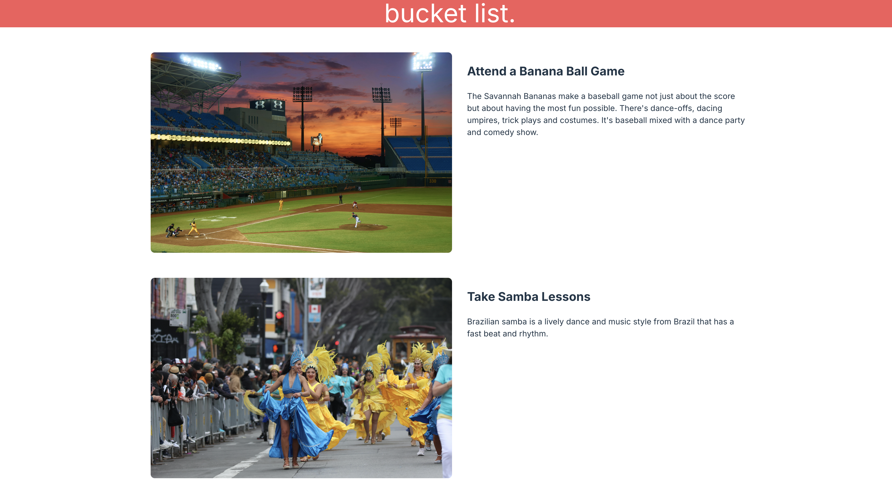

# Bucket List App


A simple bucket list application built with React. This project is designed to practice using React props, mapping over data, and rendering dynamic components.

---

## 📜 Features

- **Dynamic Rendering**: Displays a list of bucket list items with images, titles, and descriptions.
- **React Props**: Each bucket list item is rendered using props passed to a child component.
- **Efficient Data Mapping**: Maps over a data file to generate components dynamically.
- **CSS Flexbox Layout**: Styled using CSS Flexbox for a clean and responsive design.

---

## Screenshot



## 🛠️ Technologies Used

- **React**: Component-based front-end library for UI development.
- **CSS Flexbox**: For flexible and responsive layouts.

---

## 📂 Project Structure

```plaintext
src/
├── components/
│   ├── BucketListItem.jsx  # Reusable component for individual list items
│   └── App.jsx             # Main component - 
├── data/
│   └── bucketListData.js   # Contains the list of bucket items
├── index.css               # Styling with CSS Flexbox
└── index.js                # Entry point

# Clone the repository
git clone <repository-url>

# Navigate to the project directory
cd bucket-list-app

# Install dependencies
npm install

# Start the development server
npm start
